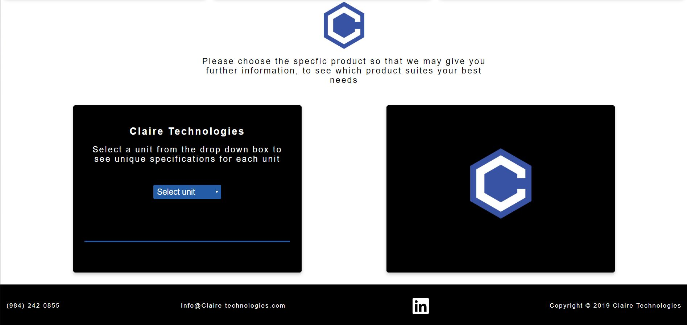

# Claire Technologies API

Polar Footprints API controls the interactions between the front end and database.

## Technologies

Claire Technologies was built using Node, Express and knex. PostgreSQL was used to built the database.

## Client Repo

<div>https://github.com/Joalvaca/Claire-Site.git</div>

## Live Site

<div><div>

# Using this API

## Gets Products

Gets product specification

## URL

```
/api/products
```

- Method

```
GET
```

- Body Params\
  none

- Success Response\
  Code: 200\
   content:

  ```
  {

        "id": 1,
        "product_name": "Platinum",
        "max_water_flow": "12 GPM",
        "quantity_of_qd": "600 grams",
        "prefiltration": "< 5 micron",
        "unit_dimensions": "11 x 3 inches",
        "expected_life": "200k gallons/ 740k liters",
        "operating_temperature": "41-100",
        "inlet_outlet": "1 inch"
  },....
  ```

* Error Response
  Code: 400

  ---
